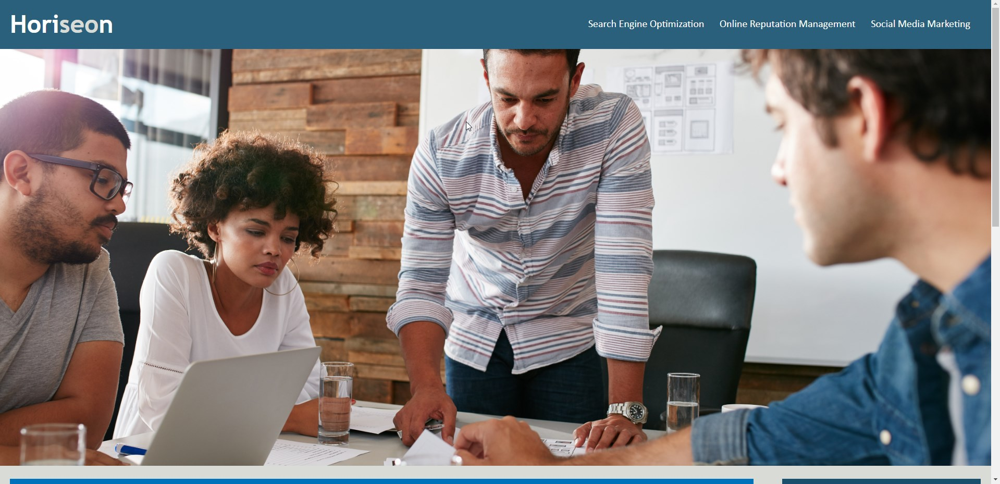
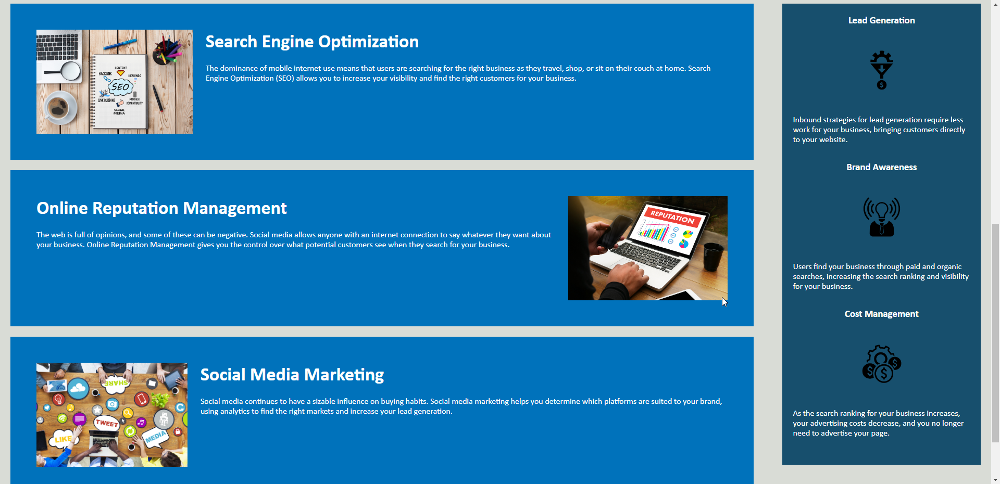

# Horiseon-Refactor-Accessibility // Week1 Challenge :On the Job Ticket

    

  

## An example PROJECT using  HTML, CSS, and Git of a marketing agency hiring me to refactor their site specifically to make it more accessible. 

*paragraph of about*

## Screen shots 

